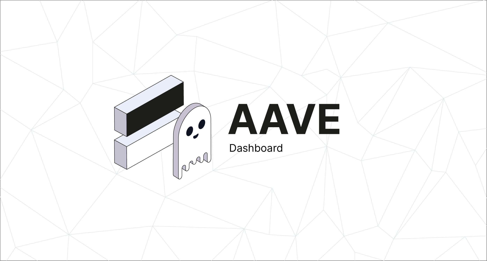

# Aave Dashboard

RPC-based dashboard for exploring Aave protocol data across chains and pools.



## Running locally

```
cp .env.example .env    # configure environment
pnpm install
pnpm dev                # dev server at localhost:3000
pnpm build              # production build
pnpm start              # serve production build
```

Works best with an Alchemy API key — it provides RPC access to all supported chains through a single key. See [`.env.example`](.env.example).

## Adding a new chain

Chain and pool configuration lives in [`src/constants.ts`](src/constants.ts). RPC client setup is in [`src/server/api/fallbacks/utils/chains.ts`](src/server/api/fallbacks/utils/chains.ts).

1. **Import the chain** from `viem/chains` and add it to `allChains`
2. **Add block time** to `BlockPeriod` record
3. **Add pool addresses** to `marketHelper` for each pool on that chain:

```typescript
[newChain.id]: {
  [PoolsWithVersions.AAVEV3]: {
    POOL: markets.AaveV3NewChain.POOL,
    UI_POOL_DATA_PROVIDER: '0x...', // deployed UiPoolDataProviderV3
    POOL_ADDRESSES_PROVIDER: markets.AaveV3NewChain.POOL_ADDRESSES_PROVIDER,
    AAVE_PROTOCOL_DATA_PROVIDER_ADDRESS: markets.AaveV3NewChain.AAVE_PROTOCOL_DATA_PROVIDER,
  },
}
```

4. **Add event pool mappings** — add entries to `poolsWithChainId` and the `PoolsWithEvents` type
5. **Ensure RPC access** — if the chain is on Alchemy, add its subdomain to `alchemySubdomains` in `chains.ts`. Otherwise, set a `RPC_CHAINNAME` env var or rely on the chain's public RPC.
6. **Update event store** in [`src/store/reservesModalSlice.ts`](src/store/reservesModalSlice.ts)

Data fetching (`getAllReservesDataRPC`, `getEmodesDataRPC`) already iterates all chains in `marketHelper` — no changes needed there for a new chain with existing pool types.

Addresses come from [`@bgd-labs/aave-address-book`](https://github.com/bgd-labs/aave-address-book).

## Adding a new pool

1. **Add enum values** in `src/constants.ts`:
   - `ReservePool` — pool name
   - `PoolsWithVersions` — pool + version combo (e.g. `NEWPOOLV3`)
2. **Add addresses** to `marketHelper` for each chain
3. **Add fetch calls** in `getAllReservesDataRPC.ts` and `getEmodesDataRPC.ts`
4. **Update pool detection** in [`src/helpers/getPoolByName.ts`](src/helpers/getPoolByName.ts) if the pool has a non-standard name

## Adding new data fields

1. **Update types**:
   - [`src/server/types.ts`](src/server/types.ts) — `ReserveItemInitial` (raw RPC response)
   - [`src/types.ts`](src/types.ts) — `ReserveItem` (formatted for UI)
2. **Format the field** in [`src/server/api/fallbacks/utils/formatReserveData.ts`](src/server/api/fallbacks/utils/formatReserveData.ts)
3. **Add table column** in [`src/helpers/tableHelpers.tsx`](src/helpers/tableHelpers.tsx):
   - Add key to `ColumnKeys` enum
   - Add column definition to `columns` array
   - Add render function to `renderFunctions`
4. **Add CSV export** in [`src/helpers/csvExport.ts`](src/helpers/csvExport.ts)
5. **Check sorting** — add custom sort logic in [`src/helpers/sorting.ts`](src/helpers/sorting.ts) if needed

## UiPoolDataProviderV3 helper contract

The dashboard reads reserve data on-chain via `UiPoolDataProviderV3` — a view-only contract that aggregates all pool state in a single RPC call. The contract source and deployment script are in [`contracts/`](contracts/).

### Deploying to a new chain

The contract needs two Chainlink price oracle addresses:

- `networkBaseTokenPriceInUsdProxyAggregator` — base token (e.g. ETH/USD)
- `marketReferenceCurrencyPriceInUsdProxyAggregator` — market reference currency

See [`contracts/DeployUiPoolDataProvider.s.sol`](contracts/DeployUiPoolDataProvider.s.sol) for per-chain oracle addresses.

Deploy with Foundry:

```
forge create contracts/UiPoolDataProviderV3.sol:UiPoolDataProviderV3 \
  --constructor-args <baseTokenOracle> <marketRefOracle> \
  --rpc-url <RPC_URL> \
  --private-key <KEY>
```

## Copyright

2024 BGD Labs
